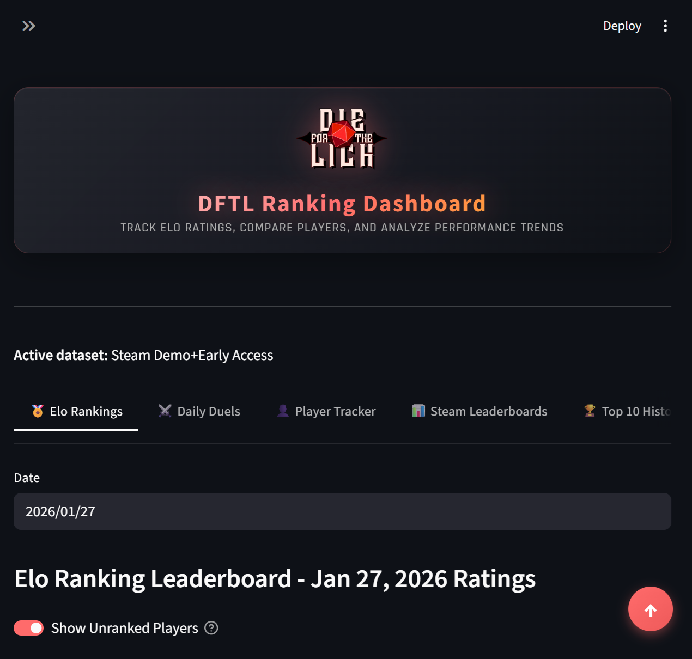

# DFTL Ranking Dashboard

A competitive Elo rating system and analytics dashboard for **Die For The Lich** (DFTL) Daily Run leaderboards. This project tracks player performance over time, computes skill-based rankings using an advanced Elo algorithm, and presents the data through an interactive Streamlit dashboard.



## Features

- **Elo Rating System** - Pairwise comparison model that evaluates every player matchup each day
- **Dynamic K-Factor** - New players gain/lose rating faster; established players have more stable ratings
- **Activity Gating** - Only players active in the last 7 days with 7+ games appear in rankings
- **Hybrid Compression** - Prevents rating inflation while allowing top players to reach high ratings
- **Interactive Dashboard** - Responsive web UI with player search, rankings, and detailed stats
- **Theme Support** - Automatic light/dark mode detection
- **Mobile-First Design** - Card-based layout optimized for all screen sizes
- **Multiple Data Views** - Track Steam Demo era, Early Access, or combined datasets

## How It Works

### The Elo Algorithm

Each day, every pair of players on the leaderboard is compared. If Player A finishes above Player B:
- Player A's expected win probability is calculated based on their rating difference
- Ratings are adjusted based on whether the result was expected or an upset
- Score gaps between players influence the magnitude of rating changes

The system uses several enhancements over standard Elo:

| Feature | Description |
|---------|-------------|
| **Dynamic K** | K-factor of 1.5x for new players (<10 games), 1.2x for provisional (10-30 games) |
| **Uncertainty** | Inactive players accumulate uncertainty, amplifying their next rating change |
| **Floor Protection** | Ratings cannot drop below 1000; winners gain less when beating low-rated players |
| **Ceiling Compression** | Logarithmic compression toward 2700, tanh asymptote at 3000 |

### Rating Scale

| Rating | Tier |
|--------|------|
| 2500+  | Elite |
| 2200-2499 | Expert |
| 1900-2199 | Advanced |
| 1600-1899 | Intermediate |
| 1300-1599 | Developing |
| 1000-1299 | Beginner |

## Installation

### Prerequisites

- Python 3.11+
- pip

### Setup

```bash
# Clone the repository
git clone https://github.com/NPrime808/DFTL_Ranking_Dashboard.git
cd DFTL_Ranking_Dashboard

# Install dependencies
pip install -r requirements.txt
```

## Usage

### Running the Dashboard

```bash
streamlit run streamlit_dashboard.py
```

The dashboard will open in your browser at `http://localhost:8501`.

### Data Pipeline

The system supports two ingestion methods:

#### 1. Discord JSON Export (Bulk Import)

Parse exported Discord channel JSON containing DFTL_BOT leaderboard messages:

```bash
python -m src.ingestion.discord_parser
```

#### 2. Paste Mode (Daily Updates)

Quickly add a single day's leaderboard by pasting the Discord message:

```bash
python -m src.ingestion.paste_mode
```

#### 3. Recompute Elo Ratings

After adding new data, recompute all ratings:

```bash
python -m src.elo.engine
```

## Project Structure

```
DFTL_Ranking_Dashboard/
├── streamlit_dashboard.py   # Main dashboard application
├── src/
│   ├── config.py            # Central configuration
│   ├── utils.py             # Shared utilities
│   ├── elo/
│   │   ├── compression.py   # Rating compression functions
│   │   └── engine.py        # Elo computation engine
│   └── ingestion/
│       ├── discord_parser.py    # JSON export parser
│       └── paste_mode.py        # Daily paste ingestion
├── data/
│   ├── raw/                 # Discord JSON exports
│   └── processed/           # Generated CSV files
└── requirements.txt
```

## Configuration

Key parameters in `src/config.py`:

| Parameter | Default | Description |
|-----------|---------|-------------|
| `BASELINE_RATING` | 1500 | Starting rating for new players |
| `K_FACTOR` | 180 | Base K-factor (higher = faster changes) |
| `MIN_GAMES_FOR_RANKING` | 7 | Games required to appear in rankings |
| `ACTIVITY_WINDOW_DAYS` | 7 | Days of inactivity before becoming unranked |
| `SOFT_TARGET` | 2700 | Rating where log compression begins |
| `HARD_CEILING` | 3000 | Theoretical maximum rating |

## Data & Privacy

This project follows data minimization principles:

| Published | Not Published |
|-----------|---------------|
| In-game player names | Discord user IDs |
| Daily ranks and scores | Discord message IDs |
| Derived Elo ratings | Platform metadata |
| Activity metrics | Raw message content |

**How it works:**
- Raw Discord exports are used only as an ingestion source (not published)
- The parser extracts only game-level data: date, player name, rank, score
- All Discord platform identifiers are discarded during processing
- Published datasets contain only leaderboard data and derived analytics

## Tech Stack

- **Python 3.11** - Core language
- **Streamlit** - Dashboard framework
- **Pandas** - Data manipulation
- **Plotly** - Interactive charts
- **NumPy** - Numerical operations

## License

- **Code**: MIT License - see [LICENSE](LICENSE)
- **Data**: CC-BY 4.0 for derived analytics - see [DATA_LICENSE.md](DATA_LICENSE.md)

Game data and leaderboard content belong to their respective owners.

---

*Built with 🫶 by N Prime, for the Die For The Lich community*
